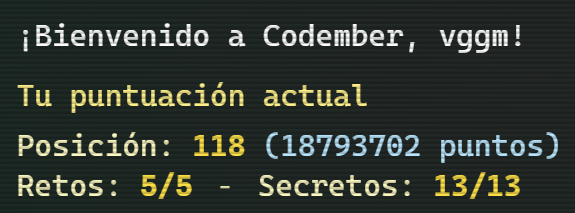

# [Codember](https://codember.dev)

Resolución de los ejercicios propuestos en [Codember.dev](https://codember.dev/). Página que realiza, durante el mes de noviembre, un serie de retos y ejercicios para toda la comunidad de desarrolladores, ideado por [@midudev](https://github.com/midudev/).

## Retos

| CHALLENGES                         | Nombre             | Completado   |
|------------------------------------|--------------------|--------------|
| [CHALLENGE_01](./CHALLENGE_01/)    | Mensaje Cifrado    |     ✅       |
| [CHALLENGE_02](./CHALLENGE_02/)    | Mini Compilador    |     ✅       |
| [CHALLENGE_03](./CHALLENGE_03/)    | Cifrado Espía      |     ✅       |
| [CHALLENGE_04](./CHALLENGE_04/)    | Archivos Dañados   |     ✅       |
| [CHALLENGE_05](./CHALLENGE_05/)    | Datos Corruptos    |     ✅       |

## Resultado de Codember 2023

Finalmente, habiendo resuelto todos los retos y descubierto todos los secretos, he conseguido quedar en la posicion `#118`. Los últimos dos retos no pude estar atento a la fecha de salida, por lo que no pude escalar muchos puestos 😅, aun así estoy muy contento con el resultado 😁.

