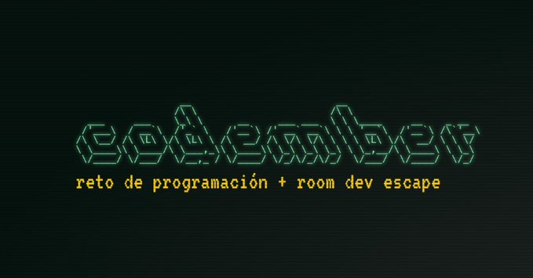

# [Codember](https://codember.dev)

Resolución de los ejercicios propuestos en [Codember.dev](https://codember.dev/). Página que realiza, durante el mes de noviembre, un serie de retos y ejercicios para toda la comunidad de desarrolladores, ideado por [@midudev](https://github.com/midudev/).

## Retos

| CHALLENGES                          | Nombre            | Completado   |
|------------------------------------|--------------------|--------------|
| [CHALLENGE_01](./CHALLENGE_01/)    | Mensaje Cifrado    |     ✅       |
| [CHALLENGE_02](./CHALLENGE_02/)    | Mini Compilador    |     ✅       |
| [CHALLENGE_03](./CHALLENGE_03/)    | Cifrado Espía      |     ✅       |
